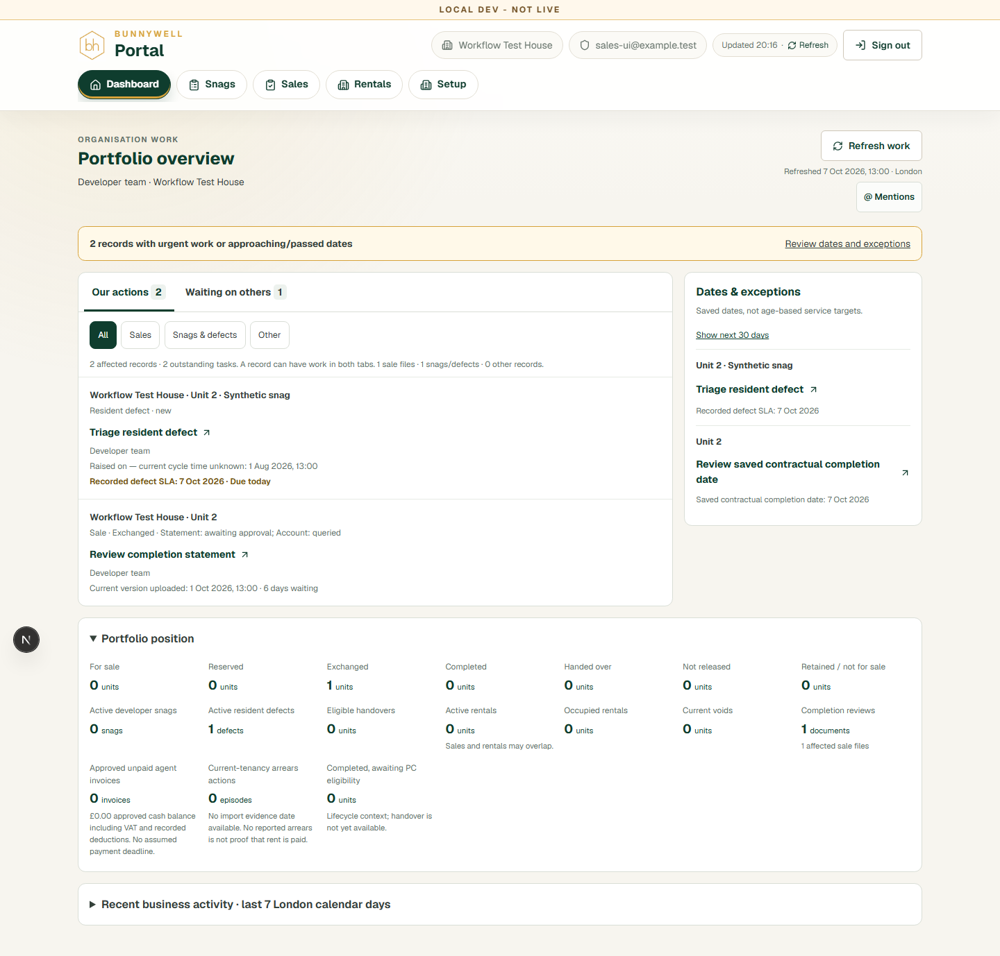
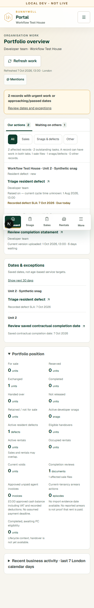

# Organisation dashboard and Sales worklists

This change replaces the internal snag hero with an organisation worklist and places the same worklist once on external Sales landing pages. It derives work from current workflow records; it adds no task table, completion flag, mutation endpoint, migration or access policy.

The implementation is on `codex/organisation-dashboard`, based on staging `1dfbeea0430739f69a9a324b822d90cce7619314`. Merging into staging and production promotion require separate approval. See [validation](validation.md), [rules](rules.md) and [review runbook](runbook.md).

## Delivered behaviour

- Our actions / Waiting on others, explicit team and building scope, module filters, ten record rows per page, grouped secondary tasks, current query/version/account context and neutral waiting ages.
- Saved deadlines, a 48-hour exchange-authority warning, seven/30-day date views, urgent resident defects, separate document/sale counts and compact portfolio/building summaries.
- Exact sale stage, current document, snag, unit handover, rental unit and access-request destinations with a return to the originating worklist scope. Stale sale/version links disclose changed context.
- Independent document approvals and replacement work follow the existing completion-review helpers. Legacy missing contractual dates and inconsistent sale/unit stages are explicit exceptions, not “portal checks complete.”
- Visible-only 60-second refresh, manual refresh, focus/reconnect refresh after 15 seconds, mutation invalidation and no overlapping requests. A failed refresh retains a labelled last-known snapshot; 401/403 or identity changes clear it.
- Existing mentions remain account-level communication. Opening work or reading a mention never resolves business work.
- Dashboard/Sales/Rentals no longer fetch snag media, complete snag histories or handover media on initial load. Operational screens load those details when opened.

## Architecture and access

`GET /api/dashboard?building=all|UUID` verifies the caller's bearer token and active profile before reading. It uses the public Supabase client with that caller's JWT and existing RLS, never a service-role portfolio query. Only six explicitly supported roles are accepted. Unknown query parameters and malformed/inaccessible building IDs are rejected. Profile and effective access keys are checked again after aggregation to reject a concurrently revoked snapshot.

The response is `private, no-store, max-age=0`, varies on Authorization, and contains scope, identity, as-of and per-source coverage. It has no shared server cache. The client also checks identity and building before publishing. Role and building changes remount the worklist. Building navigation uses visible URL state and tab-scoped session storage, cleared on sign-out; queue/module/page filters are component state with Reset filters.

`src/lib/dashboard/read.ts` retrieves necessary columns in complete counted pages of 250, with a 20,000-row ceiling per table read. Related sales reads are batched in groups of 150 IDs. Truncation, missing/changing counts or errors produce unavailable coverage rather than zero. Sources run concurrently where independent. Related legal/fee reads wait for the permitted active-sale IDs. Common dimensions must succeed. No document content, media, conversations, full audit stream, provider reconciliation or passive unit-open events are fetched by the summary route.

The complete bounded snapshot is appropriate for the stated modest workload; presentation pagination does not issue a request per row. This is not a transactionally isolated database snapshot: records may change between source queries. Version/state checks in existing mutations remain authoritative. Larger populations require a future server-paginated design rather than silently lifting bounds.

`model.ts` is a pure shared derivation using existing sales permissions, authority, completion-review, invoice, rental, lifecycle and floor-order helpers. `presentation.ts` contains grouping/filtering/navigation only, keeping domain derivation out of the browser bundle. Stable identities combine business record, task kind and relevant version/cycle. Counts and rows use the same filtered items. A record can legitimately appear in both responsibility tabs; neither mixed record counts nor summary values should be added together.

Developer operational work belongs to the developer team. External responsibility uses the attempt's recorded organisation, or a unique active building relationship of the relevant role. Missing/ambiguous relationships remain unallocated. An email address, correspondence inbox, name match or previous actor never grants access or ownership. Permission to act is derived separately from responsibility. Supporting-trade snag workflows preserve the developer's direct-close capability and do not invent a contractor action.

Equivalent authorised accounts derive identical work independently of creator, unread state, login history or unit views. Context identifies the authenticated recorded account; a shared login is never attributed to an assumed individual. Actor names come from the existing authorised projection, with honest unknown fallbacks.

## Accepted gaps and deliberate limits

**Agency isolation is not implemented.** The existing Sales access helper/RLS permits sales agents to access sales in their authorised building, including another agency's attempts. The user explicitly instructed: “Keep current access; document the gap.” This change preserves that rule. Organisation responsibility distinguishes queues; it does not restrict the underlying records, comments or direct requests. Do not represent this PR as satisfying cross-agency isolation. That requires a separate approved permission change across Sales and comments.

- Existing legacy synthetic staging data exposed missing saved dates and an exchanged sale attached to a For sale unit. New warnings cover both. Repair remains outside this dashboard's mutation scope.
- Legal delivery status has no persisted provider checked-at field. The worklist says that check time is not recorded, retains issue time as provenance and does not claim dashboard refresh contacted the provider.
- Recent activity is the latest authorised milestone per event type within seven London calendar days, using `sale_workflow_context`; it is not an exhaustive feed. Generic audit/authentication/view events are excluded. Full sale activity remains available through the context link.
- No general routing-configuration audit is added to the summary. Existing legal screens retain recipient validation. Missing ownership is shown, without treating correspondence routing as ownership.
- External agents retain their existing sale-file fee actions; no external fee portfolio or internal amounts are introduced. Internal invoice summaries exclude unsupported balance claims, forecasts and invented payment deadlines.
- Rental source dates remain separate from refresh time. Failed imports, recorded issues and missing import evidence are visible. No invented universal “stale after N days” rule, combined arrears total, banking ledger or collected-rent claim is added.
- The shell still loads existing common setup/access dimensions. This PR removes the large operational-detail reads from dashboard entry, not every legacy shell query.
- No forecasting, contractor ranking, adoption metrics, security feed, general compliance expiry, cost/profit reporting, lead CRM, mandatory claiming or new notification system is included.
